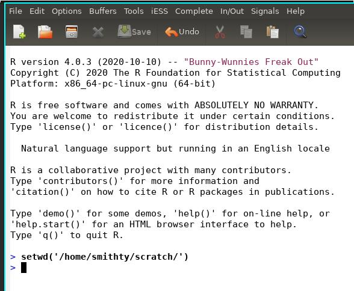

This demo is part of a series of Emacs tutorials aimed at bioinformatics
(and other scientific analysis) workflows. See the rest at
[plantarum.ca](https://plantarum.ca/tutorials/).

Emacs support for the R programming language is provided by the
[ESS](https://ess.r-project.org/ "ESS") package (AKA, "Emacs Speaks
Statistics"). ESS has been around since at least 1994, and is supported by
a very active development team. It provides most or all of the features of
the more widely-known [RStudio](https://rstudio.com/ "RStudio"), as
well as a great many more. Like all things Emacs, if it doesn't have a
feature you want, it's likely someone else has written a package that
provides it; failing that, the motivated hacker you can create their own
customizations using the built-in scripting language, elisp.

However, lets not let all that potential scare us off. Getting up and
running with ESS doesn't require much effort at all.

# Installation

## Prerequisites

You need to have `R` installed in order to use `ESS`!

## Installing ESS from MELPA

The easiest way to install it is to use the [MELPA](https://melpa.org/
"MELPA") package repository. MELPA hosts Emacs packages provided by hackers
who are not part of the Emacs development team. ("packages" here has
roughly the same meaning as "plugins" or "extensions" in other software
systems).

If you aren't already using MELPA, you need to add it to your configuration
file (typically `~/.emacs.d/init.el`, or `~/.emacs`):

```{elisp, eval = FALSE}
(require 'package)
(add-to-list 'package-archives
             '("melpa" . "https://melpa.org/packages/") t)
(package-initialize)
```

Once this code is evaluated, you can view the complete list of packages
available on MELPA via `M-x package-list-packages`. It's a *big* list, and
it will take a few seconds for Emacs to get the latest version from the
server (you need an internet connection for this).

Search down to the entry for `ESS`, select it by pressing `i`, and then
install it by pressing `x`. `ESS` is one of the larger packages, so it may
take a few seconds to download and install all the files.

Once this is done, you have `ESS`, and don't need to return to
`package-list-packages` until you want to update to a new version (or add
some other packages).

# Getting Started

ESS comes with a comprehensive manual. That will be your canonical
reference for learning about this package. However, you can get started
with just a few commands.

## Interactive R Session

From within Emacs, start R with the command `M-x R`. You will be prompted
for the project starting directory. Select whatever you like and press
enter. You will then be presented with an R shell:



You can enter code and view results here, just as you would in the terminal
in RStudio, or with R running on the command line. ESS uses the same code
to manage this as for [shell mode](/2020/06/16/emacs-tutorial-01/). That
means we can use the same keybindings here:

`<tab>`

: with the cursor at the active prompt, `tab` will complete function and
variable names, as well as the arguments for functions

`<enter>`

: with the cursor at the active prompt, send the command on the prompt to R
  for evaluation

`<enter>`

: With the cursor on a previous command, re-enter that command

`M-p` and `M-n`

: Move through your command history at the active prompt

`C-c C-p` and `C-c C-n` 

: Move the cursor to the *previous* and *next* prompts

`C-c <enter>`

: With the cursor on a previous command, copy that command the to active
  prompt, but don't enter it. This allows you to edit a previous command
  before sending a new variation to R for evaluation
  
`C-c C-o`

: Delete the output from the previous command

`C-c C-v`

: Opens a prompt to select a help file, which will be displayed in Emacs
(you can also open help files from the prompt via `?<function>`) 

These few commands cover most general interactions. There are a lot more
features available. Check the `iESS` menu item on the toolbar for some of
them; see the manual for the details.

### Plots

Calling plotting commands will create a new window (frame) for your figure.
There isn't a dedicated pane in Emacs to display them, like in RStudio, and
you can't scroll forward and backward through your history of images. You
can, however, create multiple image windows, and view them side by side.

To create and manipulate new image windows, you'll need the following
commands: 

```{R plot windows, eval = FALSE}
dev.new() ## Create new plot window, and make it the
          ## active window
dev.set() ## If more than one plot window is open,
          ## set the next window to be the active
          ##window 
```

See `?dev` page for more details.

## Writing R Scripts

After `ESS` is installed, anytime you open a file with a `.r` or `.R`
extension, it will be in `ESS[R]` mode. You can enter text as usual, and
additionally have the following helpful commands available:

`C-c C-n` or `C-c <enter>`

: send the current line to the R process and step to the next

`C-c C-r`

: send the current region to the R process

`C-c C-f`

: send the current function to the R process

`C-c C-c`

: send the current region, paragraph, or function to the R process

`C-c C-b`

: send the entire buffer to the R process

`C-c C-v`

: prompt for a help file to open

`M-tab`

: tab completion of objects (functions, variables, file names) and function
  arguments 

If there is no `R` process running when you try to send code, you will be
prompted for a working directory in which to start a new process. In
addition, you can manage `R` processes with the following commands:

`C-c C-z` 

: switch from the script buffer to the process buffer (and vice versa)

`C-c C-s`

: change the process linked to the current script buffer (e.g., if you want
  to run multiple R processes at once, with different scripts in each process)

# Next Steps

This may well be all you need, and if that's the case, you're all done.
However, there is a lot more available to you, including support for
writing documentation, package development, managing git repositories,
editing on remote servers, and more.

My advice is to start slowly. The pointers on this page will get you up and
running. When you find yourself repeating something tedious multiple times,
it may be time to investigate if there's a shortcut available to make your
life easier. I recommend skimming the manual, to get a sense of all that's
available, and if something catches your eye see about incorporating it
into your workflow.

